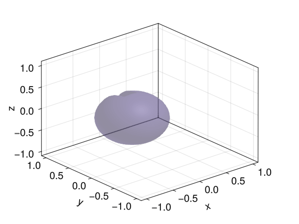

# [Zalesak disk](@id zalesak)

This example demonstrates the setup and simulation of a Zalesak disk, a standard benchmark
in computational fluid dynamics, using the `LevelSetMethods.jl`.

## Setting up the Grid and Disk

```@setup zalesak_disk_example
using LevelSetMethods
using GLMakie
LevelSetMethods.set_makie_theme!()
```

First, we create a Cartesian grid to represent the computational domain. We define a
circular disk with a rectangular cut to form the Zalesak disk.

```@example zalesak_disk_example
# Define the computational grid
grid = CartesianGrid((-1.5, -1.5), (1.5, 1.5), (100, 100))
# Define the center and radius of the circular disk
center = (-0.75, 0)
radius = 0.5
# Define the height and width of the rectangular notch
h = 1.0
w = 0.2
# Create the circular disk and rectangular notch
disk = LevelSetMethods.circle(grid; center, radius)
rec = LevelSetMethods.rectangle(grid; center = center .- (0, radius), width = (w, h))
# Use set difference to carve out the notch in the disk
ϕ = setdiff(disk, rec)
plot(ϕ)
current_figure() # hide
```

## Setting Up the Level Set Equation

We use the level set method to evolve the disk over time with a velocity field that
simulates rotation:

```@example zalesak_disk_example
# Define the advection equation with a rotational velocity field
eq = LevelSetEquation(;
    levelset = ϕ,
    terms = AdvectionTerm((x, t) -> (-x[2], x[1])),
    bc = NeumannBC(),
)
```

## Evolving the Zalesak Disk

To evolve the Zalesak disk, we integrate the level set equation over time. We will visualize
the evolution using `GLMakie`:

```@example zalesak_disk_example
obs = Observable(eq)
fig = Figure()
ax = Axis(fig[1, 1])
plot!(ax, obs)
framerate = 30
t0 = current_time(eq)
tf = 2*π
timestamps = range(t0, tf; step = 1 / framerate)
record(fig, joinpath(@__DIR__, "zalesak2d.gif"), timestamps) do t_
    integrate!(eq, t_)
    return obs[] = eq
end
```


We see some small smearing of the disk due to numerical diffusion; this is a common issue,
and the situation would be much worse with a low-order upwind scheme.

## Three-dimensional Zalesak Disk

The same example can be run in 3D, but the solution takes longer to compute and visualize.

!!! warning "Performance Warning"
    The 3D example below may take a minute or two to run.

```@setup zalesak_disk_3d
using LevelSetMethods
using GLMakie
LevelSetMethods.set_makie_theme!()
```

```julia
# 3D Zalesak's sphere example
grid = CartesianGrid((-1, -1, -1), (1, 1, 1), (50, 50, 50))
center = (-1 / 3, 0, 0)
radius = 0.5
disk = LevelSetMethods.sphere(grid; center, radius)
rec = LevelSetMethods.rectangle(
    grid;
    center = center .+ (0, radius, 0),
    width = (1 / 3, 1.0, 2),
)
ϕ = setdiff(disk, rec)
eq = LevelSetEquation(;
    levelset = ϕ,
    terms = AdvectionTerm((x, t) -> π * SVector(x[2], -x[1], 0)),
    bc = NeumannBC(),
)
LevelSetMethods.set_makie_theme!()
eq.t = 0
obs = Observable(eq)
fig = Figure()
ax = Axis3(fig[1, 1])
plot!(ax, obs)
framerate = 30
tf = 2
timestamps = range(0, tf, tf * framerate)
record(fig, joinpath(@__DIR__, "zalesak3d.gif"), timestamps) do t_
    integrate!(eq, t_)
    return obs[] = eq
end
```


