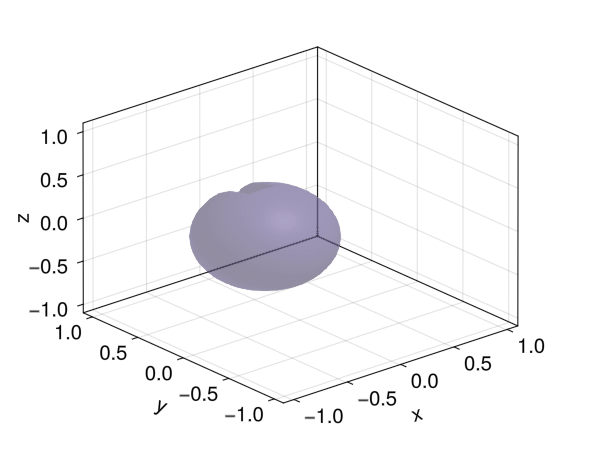

```@meta
CurrentModule = LevelSetMethods
```

# [Zalesak disk](@id zalesak)

The Zalesak disk — a slotted disk in solid-body rotation — is a standard benchmark for
advection schemes. We set it up and evolve it below.

## Setting up the grid and disk

```@setup zalesak_disk_example
using LevelSetMethods
using GLMakie
LevelSetMethods.set_makie_theme!()
```

On a Cartesian grid, we carve a rectangular notch out of a disk to form the Zalesak disk.

```@example zalesak_disk_example
grid = CartesianGrid((-1.5, -1.5), (1.5, 1.5), (100, 100))
center, radius = (-0.75, 0), 0.5
h, w = 1.0, 0.2                                   # notch height and width
disk = MeshField(x -> hypot((x .- center)...) - radius, grid)
rec  = MeshField(x -> maximum(abs.(x .- (center .- (0, radius))) .- (w, h) ./ 2), grid)
ϕ = setdiff(disk, rec)                            # carve the notch out; see the geometry page
plot(ϕ)
current_figure() # hide
```

## Setting up the level-set equation

We advect the disk with a rotational velocity field:

```@example zalesak_disk_example
eq = LevelSetEquation(;
    ic = ϕ,
    terms = AdvectionTerm((x, t) -> (-x[2], x[1])),
    bc = NeumannBC(),
)
```

## Evolving the Zalesak disk

We integrate the equation over a full revolution, recording the evolution with `GLMakie`:

```@example zalesak_disk_example
obs = Observable(eq)
fig = Figure()
ax = Axis(fig[1, 1])
plot!(ax, obs)
framerate = 30
t0 = current_time(eq)
tf = 2*π
timestamps = range(t0, tf; step = 1 / framerate)
record(fig, joinpath(@__DIR__, "zalesak2d.gif"), timestamps) do t_
    integrate!(eq, t_)
    return obs[] = eq
end
```


We see some small smearing of the disk due to numerical diffusion; this is a common issue,
and the situation would be much worse with a low-order upwind scheme.

## A three-dimensional Zalesak disk

The same example can be run in 3D, but the solution takes longer to compute and visualize.

!!! warning "Performance Warning"
    The 3D example below may take a minute or two to run.

```julia
using LevelSetMethods, GLMakie, StaticArrays
LevelSetMethods.set_makie_theme!()

grid = CartesianGrid((-1, -1, -1), (1, 1, 1), (50, 50, 50))
center = (-1 / 3, 0, 0)
radius = 0.5
disk = MeshField(x -> hypot((x .- center)...) - radius, grid)
rec  = MeshField(x -> maximum(abs.(x .- (center .+ (0, radius, 0))) .- (1 / 3, 1.0, 2) ./ 2), grid)
ϕ = setdiff(disk, rec)
eq = LevelSetEquation(;
    ic = ϕ,
    terms = AdvectionTerm((x, t) -> π * SVector(x[2], -x[1], 0)),
    bc = NeumannBC(),
)

obs = Observable(eq)
fig = Figure()
ax = Axis3(fig[1, 1])
plot!(ax, obs)
framerate = 30
tf = 2
timestamps = range(0, tf, tf * framerate)
record(fig, joinpath(@__DIR__, "zalesak3d.gif"), timestamps) do t_
    integrate!(eq, t_)
    return obs[] = eq
end
```


