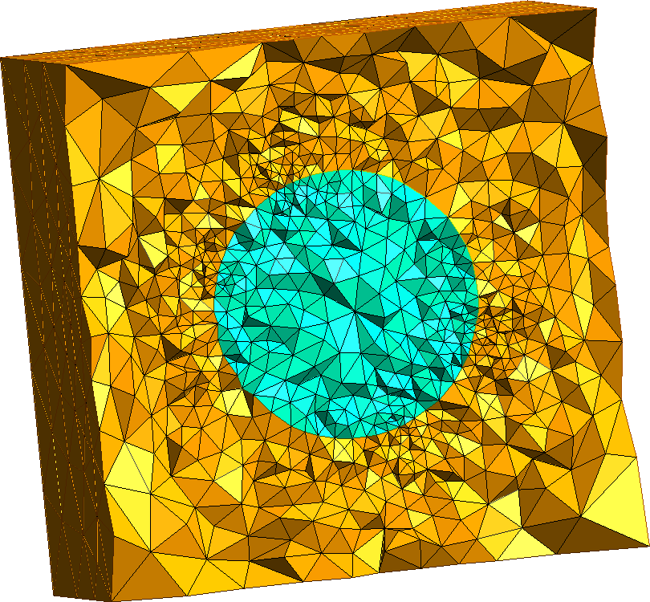

```@meta
CurrentModule = LevelSetMethods
```

# [MMG extension](@id extension-mmg)

Loading `MMG_jll` (with `MarchingCubes` for surface meshes) activates two functions that turn
a level set into an unstructured mesh via [MMG](https://github.com/MmgTools/mmg):
[`LevelSetMethods.export_volume_mesh`](@ref) meshes the interior ``\phi < 0``, and
[`LevelSetMethods.export_surface_mesh`](@ref) meshes the interface ``\phi = 0``. Both accept
optional parameters controlling element sizing:

- `hgrad` — the growth ratio allowed between two adjacent edges.
- `hmin` / `hmax` — lower and upper bounds on the edge sizes.
- `hausd` — the maximal distance between the piecewise-linear mesh and the reconstructed ideal
  boundary.

Each function writes a `.mesh` file to disk. To *see* the result we render it with
[Gmsh](https://gmsh.info); since the rendering boilerplate is the same every time, we wrap it
in a small helper that opens a mesh, applies a few display `options`, and writes a PNG
offscreen:

```@example mmg
using LevelSetMethods, MMG_jll, MarchingCubes, Gmsh, GLMakie

# render an MMG `.mesh` file to `pngfile`; `options` go straight to `gmsh.option.setNumber`,
# and `hide` lists `(dim, tag)` entities (e.g. a subdomain) to make invisible
function render_mesh(meshfile, pngfile; options = (), hide = ())
    GLMakie.closeall()          # release any GL context before Gmsh's FLTK
    gmsh.initialize()
    try
        gmsh.option.setNumber("General.Verbosity", 0)
        gmsh.open(meshfile)
        isempty(hide) || gmsh.model.setVisibility(collect(hide), 0)
        for (name, val) in options
            gmsh.option.setNumber(name, val)
        end
        gmsh.fltk.initialize()
        gmsh.write(pngfile)
        gmsh.fltk.finalize()
    finally
        gmsh.finalize()
    end
    return pngfile
end
nothing # hide
```

## Volume meshes

[`LevelSetMethods.export_volume_mesh`](@ref) meshes the enclosed region of a 2D or 3D level
set (via the `mmg2d_O3` / `mmg3d_O3` utilities). In 2D:

```@example mmg
grid = CartesianGrid((-2, -2), (2, 2), (50, 50))
ϕ = MeshField(grid) do x   # a star; see the geometry page
    r, θ = hypot(x...), atan(x[2], x[1])
    return r - (1 + 0.25 * cos(5θ))
end
volume_mesh2d = LevelSetMethods.export_volume_mesh(ϕ, joinpath(@__DIR__, "volume2D.mesh"))
```

```@example mmg
render_mesh(volume_mesh2d, joinpath(@__DIR__, "volume2d.png"))
nothing # hide
```


The 3D case is identical — pass a 3D level set; here `hausd`/`hmax` refine the mesh around the
interface:

```@example mmg
grid = CartesianGrid((-1, -1, -1), (+1, +1, +1), (40, 40, 40))
ϕ = MeshField(x -> hypot(x...) - 0.5, grid)   # a sphere; see the geometry page
volume_mesh3d = LevelSetMethods.export_volume_mesh(ϕ, joinpath(@__DIR__, "volume3d.mesh"); hausd = 0.02, hmax = 0.15)
```

MMG's level-set meshing splits the background box into two subdomains — the enclosed region
``\phi < 0`` (reference `3`) and the exterior ``\phi > 0`` (reference `2`) — which Gmsh loads
as two elementary volumes. The exterior fills the whole box and hides everything inside it, so
we make it invisible (`hide = ((3, 2),)`) and keep only the ball. Clipping the remaining mesh
through ``x = 0`` with `ClipWholeElements` then cuts away whole tetrahedra to expose the
interior:

```@example mmg
render_mesh(volume_mesh3d, joinpath(@__DIR__, "volume3d.png");
    options = ("General.Clip0A" => 1.0, "General.Clip0D" => 0.0,   # clip plane x = 0
               "General.ClipWholeElements" => 1, "Mesh.Clip" => 1,
               "Mesh.VolumeEdges" => 1, "Mesh.VolumeFaces" => 1,
               "Mesh.SurfaceEdges" => 0, "Mesh.SurfaceFaces" => 0,
               "General.RotationX" => 300, "General.RotationZ" => 160, "General.Trackball" => 0))
nothing # hide
```



The smooth left side is the tetrahedra's outer faces conforming to the spherical interface;
the jagged right side is the cutaway, revealing the tetrahedra that fill the enclosed region.

## Surface meshes

To mesh the interface itself rather than the interior, use
[`LevelSetMethods.export_surface_mesh`](@ref), which combines `MarchingCubes.jl` with MMG's
`mmgs_O3` surface remesher:

```@example mmg
grid = CartesianGrid((-2, -1, -1), (+2, +1, +1), (80, 40, 40))
ϕ₁ = MeshField(x -> hypot((x .- (-1, 0, 0))...) - 0.5, grid)
ϕ₂ = MeshField(x -> hypot((x .- (+1, 0, 0))...) - 0.5, grid)
ϕ₃ = MeshField(x -> maximum(abs.(x) .- (2, 0.25, 0.25) ./ 2), grid)
ϕ  = ϕ₁ ∪ ϕ₂ ∪ ϕ₃   # two spheres joined by a bar; see the geometry page
surf_mesh3d = LevelSetMethods.export_surface_mesh(ϕ, joinpath(@__DIR__, "surface3D.mesh"); hausd = 0.01, hmax = 0.1, hgrad = 1.3)
```

```@example mmg
render_mesh(surf_mesh3d, joinpath(@__DIR__, "surface3d.png");
    options = ("Mesh.SurfaceFaces" => 1, "Mesh.SurfaceEdges" => 1,
               "General.RotationX" => 300, "General.RotationZ" => 300, "General.Trackball" => 0))
nothing # hide
```


