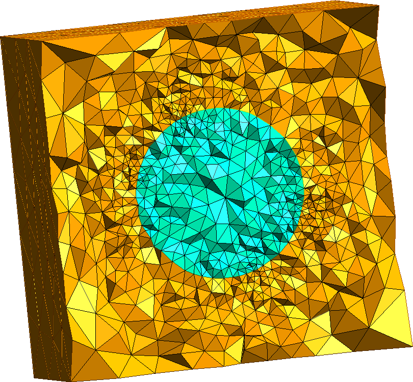

# [MMG extension](@id extension-mmg)

This extension provides functions to generate meshes of levelset functions using [MMG](https://www.mmgtools.org/).
It define two methods: `export_volume_mesh` and `export_surface_mesh`.
For both of them, it is possible to control the size of the generated mesh using the following optional parameters:

- `hgrad` control the growth ratio between two adjacent edges.
- `hmin` and `hmax` control the edge sizes to be (respectively) greater than the `hmin` parameter and lower than the `hmax` one.
- `hausd` control the maximal distance between the piecewise linear representation of the boundary and the reconstructed ideal boundary.

## Generation of 2D and 3D mesh from a level-set

For 2 and 3 dimensional Cartesian levelset, one can use the `export_volume_mesh` function to generate meshes.
This method relies on the `mmg2d_O3` and `mmg3d_O3` utilities.
Example in 2D:

```julia
using LevelSetMethods, MMG_jll
grid = CartesianGrid((-1, -1), (+1, +1), (50, 50))
ϕ = LevelSetMethods.star(grid)
LevelSetMethods.export_volume_mesh(ϕ, "Volume2D.mesh")
```


And similarly in 3D:

```julia
using LevelSetMethods, MMG_jll
grid = CartesianGrid((-1, -1, -1), (+1, +1, +1), (20, 20, 20))
ϕ = LevelSetMethods.sphere(grid)
LevelSetMethods.export_volume_mesh(ϕ, "Volume3D.mesh")
```



## Generation of 3D surface mesh with MarchingCubes.jl

Using the `mmgs_O3` utility, the `MarchingCubes.jl` library and the `export_surface_mesh` function it is possible to obtain a mesh of the levelset contour.

```julia
using LevelSetMethods, MMG_jll, MarchingCubes
grid = CartesianGrid((-2, -1, -1), (+2, +1, +1), (40, 20, 20))
ϕ = LevelSet(x -> 1.0, grid)
add_circle!(ϕ, [-1.0, 0.0, 0.0], 0.75)
add_circle!(ϕ, [+1.0, 0.0, 0.0], 0.75)
add_rectangle!(ϕ, [0.0, 0.0, 0.0], [2.0, 0.5, 0.5])
LevelSetMethods.export_surface_mesh(ϕ, "Surface3D.mesh"; hausd = 1.2, hmax = 1.0)
```


